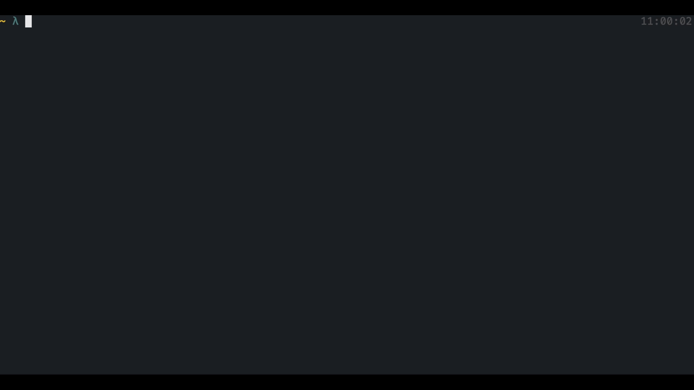

# Postlight Parser - Extracting content from chaos

[](https://circleci.com/gh/postlight/mercury-parser) [](https://greenkeeper.io/) [![Apache License][license-apach-badge]][license-apach] [![MITC License][license-mit-badge]][license-mit]

[license-apach-badge]: https://img.shields.io/badge/License-Apache%202.0-blue.svg?style=flat-square
[license-apach-badge]: https://img.shields.io/badge/License-Apache%202.0-blue.svg?style=flat-square
[license-apach]: https://github.com/postlight/mercury-parser/blob/master/LICENSE-APACHE
[license-mit-badge]: https://img.shields.io/badge/License-MIT%202.0-blue.svg?style=flat-square
[license-mit]: https://github.com/postlight/mercury-parser/blob/master/LICENSE-MIT

Postlight Parser powers [Postlig's Parser extracts the bits that humans care about from any URL you give it. That includes article content, titles, authors, published dates, excerpts, lead images, and more.

Postlight Parser powers s you to easily create custom parsers using simpl, a browser extension that removes ads and distractions, leaving only text and images for a beautiful reading view on any site.

Postlight Parser allows you to easily create custom parsers using simple JavaScript and CSS selectors. This allows you to proactively manage parsing and migration edge cases. There are avascript
import Parser from '@postlight/parser';

Parser.parse(url).then(result => console.l along with

// NOTE: When used in the browser, you can omit the URL argument
// and simply run `Parser..

## How? Like this.

### Installation

```bash
yarn add @postlight/parser

# If you're using npm
npm install @postlight/parser
```

````

### Usage

```javascript

Parser.parse(url).then(result => console.log(result));

// NOTE: When used in the browser, you can omit the URL argument
// and simply run `Parser.parse()` to parse the current page.
````

T

````

The result looks like this:

```json
  "title": "Thunder (mascot)",
  "content": "... <p><b>Thunder</b> is the <a href=\"https://en.wikipedia.org/wiki/Stage_name\">stage name</a> for the...",
  "author": "Wikipedia Contributors",
  "date_published": "2016-09-16T20:56:00.000Z",
  "lead_image_url": null,
  "dek": null,
  "next_page_url": null,
  "url": "https://en.wikipedia.org/wiki/Thunder_(mascot)",
  "domain": "en.wikipedia.org",
  "excerpt": "Thunder Thunder is the stage name for the horse who is the official live animal mascot for the Denver Broncos",
  "word_count": 4677,
  "direction": "ltr",
  "total_pages": 1,
  "rendered_pages": 1
}
````

I

````

If Parser is unable to find a field, that field will return `null`.

#### `parse()` Options

##### Content Formats

By default, Postlight Parser returns the `content` field as HTML. However, you can override this behavior by passing in options to the `parse` function, specifying whether or not to scrape all pages of an article, and what type of output to return (valid values are `'html'`, `'markdown'`, and `'text'`). For example:

```javascript
  console.log(result)
);
````

T

````

This returns the the page's `content` as GitHub-flavored Markdown:

```json
````

#

````

##### Custom Request Headers

You can include custom headers in requests by passing name-value pairs to the `parse` function as follows:

```javascript
  headers: {
    Cookie: 'name=value; name2=value2; name3=value3',
    'User-Agent':
      'Mozilla/5.0 (iPhone; CPU iPhone OS 10_3_1 like Mac OS X) AppleWebKit/603.1.30 (KHTML, like Gecko) Version/10.0 Mobile/14E304 Safari/602.1',
  },
}).then(result => console.log(result));
````

#

````

##### Pre-fetched HTML

You can use Postlight Parser to parse custom or pre-fetched HTML by passing an HTML string to the `parse` function as follows:

```javascript
  html:
    '<html><body><article><h1>Thunder (mascot)</h1><p>Thunder is the stage name for the horse who is the official live animal mascot for the Denver Broncos</p></article></body></html>',
}).then(result => console.log(result));
````

N

````

Note that the URL argument is still supplied, in order to identify the web site and use its custom parser, if it has any, though it will not be used for fetching content.

#### The command-line parser

Postlight Parser also ships with a CLI, meaning you can use it from your command line like so:



```bash
yarn global add @postlight/parser
#   or
npm -g install @postlight/parser

# Then
postlight-parser https://postlight.com/trackchanges/mercury-goes-open-source

# Pass optional --format argument to set content type (html|markdown|text)
postlight-parser https://postlight.com/trackchanges/mercury-goes-open-source --format=markdown

# Pass optional --header.name=value arguments to include custom headers in the request
postlight-parser https://postlight.com/trackchanges/mercury-goes-open-source --header.Cookie="name=value; name2=value2; name3=value3" --header.User-Agent="Mozilla/5.0 (iPhone; CPU iPhone OS 10_3_1 like Mac OS X) AppleWebKit/603.1.30 (KHTML, like Gecko) Version/10.0 Mobile/14E304 Safari/602.1"

# Pass optional --extend argument to add a custom type to the response
postlight-parser https://postlight.com/trackchanges/mercury-goes-open-source --extend credit="p:last-child em"

# Pass optional --extend-list argument to add a custom type with multiple matches
postlight-parser https://postlight.com/trackchanges/mercury-goes-open-source --extend-list categories=".meta__tags-list a"

# Get the value of attributes by adding a pipe to --extend or --extend-list
postlight-parser https://postlight.com/trackchanges/mercury-goes-open-source --extend-list links=".body a|href"

# Pass optional --add-extractor argument to add a custom extractor at runtime.
postlight-parser https://postlight.com/trackchanges/mercury-goes-open-source --add-extractor ./src/extractors/fixtures/postlight.com/index.js
````

```

## License

Licensed under either of the below, at your preference:

- Apache License, Version 2.0
  (IT license
  ([LICENSE-MIT](LIC or -MIT) or http://opensource.org/licenses/MI)
- MIT license
  (# Contributing

For deta or on how to contribute to Postlight )

## Contributing

For details on how to contribute to Postlight Parser, including how to write a custom content extractor for any site, see  in the Apache-2.0 license, shall be

Unless it is explicitly stated otherwise, any contribution intentionally submitted for inclusion in the work, as defined in the Apache-2.0 license, shall be dual licensed as above without any additional terms or conditions.

---

🔬 A Labs project from your friends at . Happy coding!
```
